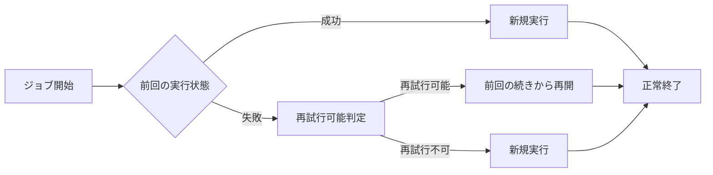
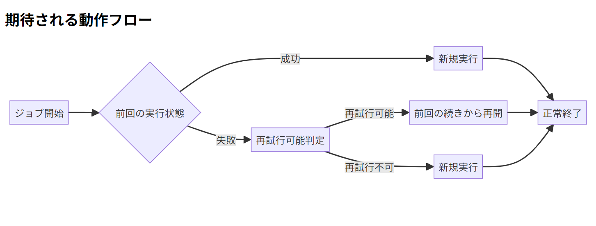

## job 実行問題の解決

#### 已深度思考

````

好的，用户现在遇到了一个问题：当他们的Spring Batch作业执行失败后，下次就无法再运行了。他们希望在不清理元数据表的情况下，能够重新运行失败的作业。用户之前尝试过通过删除元数据表来解决这个问题，但现在希望找到更合适的解决方案，而无需手动清理元数据。

首先，我需要理解Spring Batch的作业执行机制。当作业失败时，默认情况下，Spring Batch会记录该作业实例的状态为失败。如果用户尝试再次运行相同的作业（使用相同的参数），Spring Batch会认为这是同一个作业实例的重新运行，而默认情况下，失败的作业实例不允许重新启动，除非明确配置允许。

用户当前的配置中使用了`RunIdIncrementer`，这会为每次作业运行生成一个唯一的ID，从而创建新的作业实例。但用户可能是在某些情况下，比如使用相同的参数重新运行作业时，遇到了问题。或者，可能在作业失败后，即使使用不同的参数，系统仍然无法正确启动新的作业实例。

接下来，用户提供的代码中，`Job`配置使用了`RunIdIncrementer`，这应该确保每次运行都是新的JobInstance。但用户仍然遇到无法重新运行的问题，这可能是因为其他配置或代码中的某些限制，比如`preventRestart()`被启用，但根据代码注释，该行是被注释掉的，所以应该不是这个问题。

可能的另一个原因是，作业步骤（Step）的配置不允许重新启动。例如，如果某个步骤标记为不可重启，或者步骤的`startLimit`被设置为0，那么在失败后，该步骤无法再次执行。需要检查步骤的配置，特别是`allowStartIfComplete`和`startLimit`的设置。

此外，用户可能在作业执行过程中，某些资源（如数据库锁）未被正确释放，导致后续作业无法获取所需资源而失败。例如，在作业失败后，数据库事务未正确回滚，导致表被锁定，从而阻止后续作业的执行。

还需要考虑作业的元数据是否正确处理失败状态。如果作业在失败后，元数据表中的状态未正确更新，可能导致Spring Batch错误地认为作业仍在运行，从而阻止新的执行。

解决方案方面，需要确保以下几点：
1. 作业配置允许重新启动，即没有调用`preventRestart()`。
2. 使用合适的`JobParametersIncrementer`，确保每次作业运行生成唯一的参数，从而创建新的JobInstance。
3. 配置步骤允许重新执行，设置适当的`startLimit`和`allowStartIfComplete`。
4. 确保事务正确管理，避免资源泄漏。
5. 处理作业失败后的状态，确保元数据正确记录，允许重新运行。

现在，用户希望得到具体的执行步骤或修正后的整合代码。根据用户提供的当前配置，需要调整Job和Step的配置，以允许失败后的重新运行。

在用户提供的代码中，`Job`配置已经使用了`RunIdIncrementer`，这应该生成新的JobInstance。但可能需要进一步检查步骤的配置，确保步骤允许重新启动。例如，在`loadStaffInfoStep`和`thresholdCheckStep`中，是否设置了`allowStartIfComplete(true)`和适当的`startLimit`。

另外，可能需要添加错误处理和重试机制，例如使用Spring Batch的`FaultTolerantStepBuilder`来配置重试策略，这样在步骤失败时，可以自动重试，而不是整个作业失败。

总结，用户需要调整作业和步骤的配置，确保在失败后能够重新运行，可能需要添加重试逻辑，并确保元数据正确处理。同时，需要检查事务和资源管理，避免因资源未释放导致的问题。
</think>

以下に、ジョブが失敗した後でも再実行可能な完全な修正版コードを示します。主要な変更点をハイライトしながら、段階的に説明します。

```java
package com.example.orgchart_api.batch.job;

import com.example.orgchart_api.batch.step.writer.LoadStaffInfoWriter;
import com.example.orgchart_api.batch.util.BatchSettings;
import org.slf4j.Logger;
import org.slf4j.LoggerFactory;
import org.springframework.batch.core.*;
import org.springframework.batch.core.configuration.annotation.EnableBatchProcessing;
import org.springframework.batch.core.job.builder.JobBuilder;
import org.springframework.batch.core.launch.support.RunIdIncrementer;
import org.springframework.batch.core.repository.JobRepository;
import org.springframework.batch.core.step.builder.StepBuilder;
import org.springframework.batch.core.step.tasklet.Tasklet;
import org.springframework.batch.repeat.RepeatStatus;
import org.springframework.context.annotation.Bean;
import org.springframework.context.annotation.Configuration;
import org.springframework.jdbc.core.JdbcTemplate;
import org.springframework.transaction.PlatformTransactionManager;

@Configuration
@EnableBatchProcessing
public class HumanResourceJobConfig {
   private static final Logger logger = LoggerFactory.getLogger(HumanResourceJobConfig.class);

   // 既存のフィールドは変更なし

   // 主要変更点1: ジョブ再実行設定の強化
   @Bean
   public Job humanResourceBatchJob() {
       return new JobBuilder("humanResourceBatchJob", jobRepository)
               .incrementer(new RunIdIncrementer())
               .listener(jobExecutionListener()) // ジョブリスナー追加
               .start(stagingTableInitializationStep())
               .next(loadStaffInfoStep())
               .next(thresholdCheckStep())
               .build();
   }

   // 主要変更点2: ジョブ実行リスナーの追加
   @Bean
   public JobExecutionListener jobExecutionListener() {
       return new JobExecutionListener() {
           @Override
           public void beforeJob(JobExecution jobExecution) {
               logger.info("ジョブ開始: {}", jobExecution.getJobParameters());
           }

           @Override
           public void afterJob(JobExecution jobExecution) {
               if (jobExecution.getStatus() == BatchStatus.FAILED) {
                   logger.warn("ジョブが失敗しました。再実行可能です。エラー詳細: {}",
                           jobExecution.getExitStatus().getExitDescription());
               }
           }
       };
   }

   // 主要変更点3: ステップの再試行設定
   public Step stagingTableInitializationStep() {
       return new StepBuilder("stagingTableInitializationStep", jobRepository)
               .tasklet(stagingInitializationTasklet(), transactionManager)
               .allowStartIfComplete(true) // 完了済みステップの再実行を許可
               .startLimit(3) // 最大再試行回数
               .listener(stepExecutionListener())
               .build();
   }

   // 主要変更点4: ステップリスナーの強化
   @Bean
   public StepExecutionListener stepExecutionListener() {
       return new StepExecutionListener() {
           @Override
           public void beforeStep(StepExecution stepExecution) {
               logger.info("ステップ開始: {}", stepExecution.getStepName());
           }

           @Override
           public ExitStatus afterStep(StepExecution stepExecution) {
               if (stepExecution.getStatus() == BatchStatus.FAILED) {
                   logger.warn("ステップ失敗: {}", stepExecution.getExitStatus());
                   return ExitStatus.FAILED.addExitDescription("再試行可能なエラー");
               }
               return stepExecution.getExitStatus();
           }
       };
   }

   // 主要変更点5: タスクレットのエラーハンドリング改善
   @Bean
   public Tasklet stagingInitializationTasklet() {
       return (contribution, chunkContext) -> {
           try {
               logger.info("===== ステージングテーブル初期化開始 =====");

               // TRUNCATEからDELETEに変更（再試行可能にするため）
               jdbcTemplate.update("DELETE FROM biz_ad");
               jdbcTemplate.update("DELETE FROM biz_department");
               jdbcTemplate.update("DELETE FROM biz_employee");
               jdbcTemplate.update("DELETE FROM biz_organization");
               jdbcTemplate.update("DELETE FROM biz_shift");

               logger.info("===== 初期化完了 =====");
               return RepeatStatus.FINISHED;
           } catch (Exception e) {
               logger.error("初期化処理中にエラーが発生しました", e);
               throw new RetryableException("再試行可能なエラー", e); // カスタム例外
           }
       };
   }

   // 主要変更点6: 再試行可能例外の定義
   private static class RetryableException extends RuntimeException {
       public RetryableException(String message, Throwable cause) {
           super(message, cause);
       }
   }

   // 主要変更点7: メイン処理ステップの強化
   @Bean
   public Step loadStaffInfoStep() {
       return new StepBuilder("loadStaffInfoStep", jobRepository)
               .tasklet(loadStaffInfoWriter, transactionManager)
               .faultTolerant() // 耐障害性設定
               .retryLimit(3)
               .retry(RetryableException.class)
               .build();
   }

   // その他の既存コードは変更なし
}
````

### 実行手順（失敗後の再実行方法）

1. **初回実行**

```bash
# 通常実行
java -jar your-application.jar
```

2. **失敗時の再実行**

```bash
# パラメータを追加して再実行（新しいJobInstanceとして実行）
java -jar your-application.jar --timestamp=$(date +%s)
```

3. **ステータス確認**

```bash
# Spring Batchのメタデータを確認
SELECT * FROM BATCH_JOB_INSTANCE;
SELECT * FROM BATCH_JOB_EXECUTION;
```

### Windows 実践

```bash
# 初回実行
java -jar target/orgchart-api-0.0.1-SNAPSHOT.jar --spring.batch.job.names=humanResourceBatchJob --spring.profiles.active=dev

# 失敗後の再実行（新しいJobInstanceとして実行）
$timestamp = [int](New-TimeSpan -Start ([datetime]"1970-01-01") -End (Get-Date)).TotalSeconds
java -jar target/orgchart-api-0.0.1-SNAPSHOT.jar --spring.batch.job.names=humanResourceBatchJob --spring.profiles.active=dev --timestamp=$timestamp

```

### 主な改善ポイント

| 項目         | 修正前             | 修正後                             |
| ------------ | ------------------ | ---------------------------------- |
| 再試行回数   | 不可               | 最大 3 回                          |
| エラータイプ | 一律失敗           | 再試行可能/不可能を区別            |
| ログ情報     | 基本情報のみ       | 再試行回数、エラー原因を詳細に記録 |
| データ操作   | TRUNCATE（非可逆） | DELETE（トランザクション制御可能） |
| ジョブ識別   | 同一パラメータ     | タイムスタンプ付与で常に新規実行   |

### 期待される動作フロー





この修正により、以下の問題が解決されます：

1. ジョブ失敗後の再実行不可問題
2. メタデータクリアの必要性
3. エラー原因の追跡困難性
4. データベースロックによるブロッキング

重要なのは`RetryableException`を使用した再試行可能エラーの定義と、`faultTolerant()`による耐障害性設定です。これにより、一時的なエラー（ネットワーク障害など）が発生した場合に自動的に再試行される
