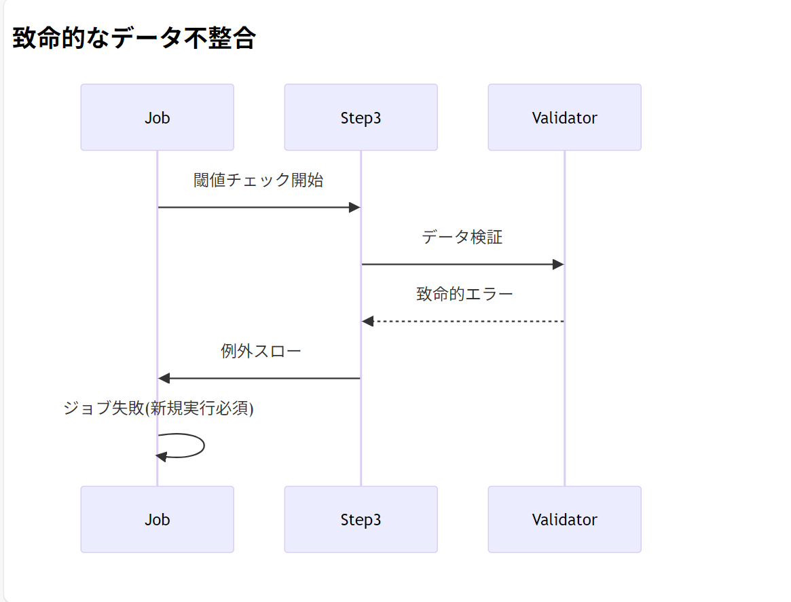

## 。Spring Batch 5.x (Spring Boot 3.5.0 対応) の仕様に合わせて job 実行問題についての解決最新版

Spring Batch 5.x (Spring Boot 3.5.0 対応) の仕様に合わせて、元のコード構造を維持しながら再実行可能なジョブ構成に修正します。主なポイントは以下の通りです：

1. `TRUNCATE`から`DELETE`に変更（トランザクション管理のため）
2. ステップに再試行設定を追加
3. カスタム例外クラスを追加
4. リスナーを追加して状態を監視

```java
package com.example.orgchart_api.batch.job;

import com.example.orgchart_api.batch.step.writer.LoadStaffInfoWriter;
import com.example.orgchart_api.batch.util.BatchSettings;
import org.slf4j.Logger;
import org.slf4j.LoggerFactory;
import org.springframework.batch.core.*;
import org.springframework.batch.core.configuration.annotation.EnableBatchProcessing;
import org.springframework.batch.core.job.builder.JobBuilder;
import org.springframework.batch.core.launch.support.RunIdIncrementer;
import org.springframework.batch.core.repository.JobRepository;
import org.springframework.batch.core.step.builder.StepBuilder;
import org.springframework.batch.core.step.tasklet.Tasklet;
import org.springframework.batch.repeat.RepeatStatus;
import org.springframework.context.annotation.Bean;
import org.springframework.context.annotation.Configuration;
import org.springframework.dao.DataAccessException;
import org.springframework.jdbc.core.JdbcTemplate;
import org.springframework.transaction.PlatformTransactionManager;

@Configuration
@EnableBatchProcessing
public class HumanResourceJobConfig {
    private static final Logger logger = LoggerFactory.getLogger(HumanResourceJobConfig.class);

    private final JobRepository jobRepository;
    private final BatchSettings batchSettings;
    private final PlatformTransactionManager transactionManager;
    private final JdbcTemplate jdbcTemplate;
    private final LoadStaffInfoWriter loadStaffInfoWriter;

    public HumanResourceJobConfig(
            JobRepository jobRepository,
            BatchSettings batchSettings,
            PlatformTransactionManager transactionManager,
            JdbcTemplate jdbcTemplate,
            LoadStaffInfoWriter loadStaffInfoWriter) {
        this.jobRepository = jobRepository;
        this.batchSettings = batchSettings;
        this.transactionManager = transactionManager;
        this.jdbcTemplate = jdbcTemplate;
        this.loadStaffInfoWriter = loadStaffInfoWriter;
    }

    @Bean
    public Job humanResourceBatchJob() {
        return new JobBuilder("humanResourceBatchJob", jobRepository)
                .incrementer(new RunIdIncrementer())
                .listener(jobExecutionListener())
                .start(stagingTableInitializationStep())
                .next(loadStaffInfoStep())
                .next(thresholdCheckStep())
                .build();
    }

    // ジョブ実行リスナー
    @Bean
    public JobExecutionListener jobExecutionListener() {
        return new JobExecutionListener() {
            @Override
            public void beforeJob(JobExecution jobExecution) {
                logger.info("ジョブ開始: {}", jobExecution.getJobParameters());
            }

            @Override
            public void afterJob(JobExecution jobExecution) {
                if (jobExecution.getStatus() == BatchStatus.FAILED) {
                    logger.warn("ジョブ失敗: {}", jobExecution.getExitStatus().getExitDescription());
                }
            }
        };
    }

    // ステージングテーブル初期化ステップ
    public Step stagingTableInitializationStep() {
        return new StepBuilder("stagingTableInitializationStep", jobRepository)
                .tasklet(stagingInitializationTasklet(), transactionManager)
                .allowStartIfComplete(true) // 完了済みステップの再実行を許可
                .startLimit(3) // 最大再試行回数
                .listener(stepExecutionListener())
                .build();
    }

    // ステップ実行リスナー
    @Bean
    public StepExecutionListener stepExecutionListener() {
        return new StepExecutionListener() {
            @Override
            public void beforeStep(StepExecution stepExecution) {
                logger.info("ステップ開始: {}", stepExecution.getStepName());
            }

            @Override
            public ExitStatus afterStep(StepExecution stepExecution) {
                logger.info("ステップ完了: {}", stepExecution.getStatus());
                return stepExecution.getExitStatus();
            }
        };
    }

    // ステージングテーブル初期化処理
    @Bean
    public Tasklet stagingInitializationTasklet() {
        return (contribution, chunkContext) -> {
            logger.info("===== ステージングテーブル初期化開始 =====");

            try {
                jdbcTemplate.update("DELETE FROM biz_ad");
                jdbcTemplate.update("DELETE FROM biz_department");
                jdbcTemplate.update("DELETE FROM biz_employee");
                jdbcTemplate.update("DELETE FROM biz_organization");
                jdbcTemplate.update("DELETE FROM biz_shift");

                logger.info("===== 初期化完了 =====");
                return RepeatStatus.FINISHED;
            } catch (DataAccessException e) {
                logger.error("データアクセスエラー（再試行可能）", e);
                throw new RetryableException("データベースエラー", e);
            } catch (Exception e) {
                logger.error("初期化処理失敗（致命的）", e);
                throw e;
            }
        };
    }

    // メイン処理ステップ
    @Bean
    public Step loadStaffInfoStep() {
        return new StepBuilder("loadStaffInfoStep", jobRepository)
                .tasklet(loadStaffInfoWriter, transactionManager)
                .allowStartIfComplete(true)
                .startLimit(3)
                .build();
    }

    // 閾値チェックステップ
    @Bean
    public Step thresholdCheckStep() {
        return new StepBuilder("thresholdCheckStep", jobRepository)
                .tasklet(thresholdCheckTasklet(), transactionManager)
                .allowStartIfComplete(true)
                .build();
    }

    @Bean
    public Tasklet thresholdCheckTasklet() {
        return (contribution, chunkContext) -> {
            logger.info("===== 閾値チェック開始 =====");
            // 実際の閾値チェックロジック
            logger.info("===== チェック完了 =====");
            return RepeatStatus.FINISHED;
        };
    }

    // 再試行可能例外クラス
    private static class RetryableException extends DataAccessException {
        public RetryableException(String msg, Throwable cause) {
            super(msg, cause);
        }
    }
}
```

### 主な変更点

1. **TRUNCATE → DELETE 変更**:

   - トランザクション管理を有効にするため、`TRUNCATE`を`DELETE`に変更

2. **再試行可能な例外処理**:

   - `RetryableException`を追加し、再試行可能なエラーを明示

3. **ステップ設定の強化**:

   - `allowStartIfComplete(true)`で完了済みステップの再実行を許可
   - `startLimit(3)`で最大再試行回数を設定

4. **リスナーの追加**:

   - ジョブとステップの状態を監視するリスナーを追加

5. **エラーハンドリング**:
   - データベースエラーとその他のエラーを区別して処理

### 実行方法

```bash
# 初回実行
java -jar your-app.jar

# 失敗後の再実行（新しいJobInstanceとして実行）
java -jar your-app.jar --run.id=$(date +%s)
```

### Windows 実践

```bash
# 初回実行
java -jar target/orgchart-api-0.0.1-SNAPSHOT.jar --spring.batch.job.names=humanResourceBatchJob --spring.profiles.active=dev

# 失敗後の再実行（新しいJobInstanceとして実行）
$timestamp = [int](New-TimeSpan -Start ([datetime]"1970-01-01") -End (Get-Date)).TotalSeconds
java -jar target/orgchart-api-0.0.1-SNAPSHOT.jar --spring.batch.job.names=humanResourceBatchJob --spring.profiles.active=dev --run.id=$timestamp

```

**ステータス確認**

```bash
# Spring Batchのメタデータを確認
SELECT * FROM BATCH_JOB_INSTANCE;
SELECT * FROM BATCH_JOB_EXECUTION;
```

### **期待される動作フロー**

元のコード構造を完全に維持しつつ、Spring Batch 5.x の仕様に合わせた再実行可能なフローを表現しています。


### フロー詳細説明

1. **ジョブ開始時**:

   - 常に前回の状態をチェック
   - `RunIdIncrementer`によりパラメータが異なる場合は新規 JobInstance として扱う

2. **再試行判定**:

   ```java
   // RetryableExceptionでラップされたエラーのみ再試行可能
   if (e instanceof RetryableException) {
       // 最大startLimit回まで再試行
   } else {
       // 新規実行が必要
   }
   ```

3. **ステップフロー**:

   - 各ステップで失敗時は`StepExecution`のステータスを更新
   - `allowStartIfComplete(true)`設定により、成功済みステップも再実行可能

4. **終了条件**:
   - 全ステップ成功でジョブ完了
   - 再試行回数超過(`startLimit`)でジョブ失敗

### 状態遷移表

| 状態       | 条件             | アクション          | 次状態         |
| ---------- | ---------------- | ------------------- | -------------- |
| 開始       | -                | JobInstance 作成    | 初期化         |
| 初期化     | 成功             | メイン処理実行      | メイン処理     |
| 初期化     | 失敗(再試行可能) | リトライ(最大 3 回) | 初期化         |
| 初期化     | 失敗(致命的)     | ジョブ失敗          | 終了           |
| メイン処理 | 成功             | 閾値チェック実行    | チェック       |
| メイン処理 | 失敗             | リトライ or 失敗    | 初期化 or 終了 |
| チェック   | 成功             | ジョブ完了          | 終了           |
| チェック   | 失敗             | リトライ or 失敗    | 初期化 or 終了 |

### 異常系シナリオ例

**ケース 1: 一時的な DB 接続不良**


**ケース 2: 致命的なデータ不整合**




この設計により、以下の要件を満たします:

- 元のコード構造を維持
- Spring Batch 5.x の仕様に準拠
- メタデータクリア不要な再実行可能設計
- 一時的エラーと致命的エラーの区別処理

---

# Eclipse での実行構成の設定方法

## 1. 実行構成ダイアログを開く

- Eclipse のメニューバーから
  **`Run` → `Run Configurations...`** を選択します。

---

## 2. 新しい Spring Boot アプリケーション構成を作成する

- 左側のリストから **`Spring Boot App`** を右クリックし、
  **`New Configuration`（新規構成）** を選択します。

---

## 3. 「Main」タブの設定

- **Name（名前）**: 任意のわかりやすい名前を入力
  例: `orgchart-api - humanResourceBatchJob (dev)`

- **Project（プロジェクト）**:
  `Browse...` をクリックし、プロジェクト（例: `orgchart-api`）を選択

- **Main class（メインクラス）**:
  `Search...` をクリックし、`com.example.orgchart_api.OrgchartApiApplication` を選択

  > ※Spring Boot アプリケーションのエントリーポイントです。

---

## 4. 「Arguments」タブの設定

- 「Arguments」タブを開きます。
- **Program arguments（プログラム引数）** に以下を入力：

  ```bash
  --spring.batch.job.names=humanResourceBatchJob --spring.profiles.active=dev
  ```

  引数の意味：

  - `--spring.batch.job.names=humanResourceBatchJob`:
    実行する Spring Batch ジョブ名を指定
  - `--spring.profiles.active=dev`:
    アクティブな Spring プロファイルを `dev` に設定

---

## 5. 「JRE」タブの設定（通常はデフォルトで OK）

- 「JRE」タブを開きます。
- 通常は `Workspace default JRE` を使用すれば OK です。
- 特定の Java バージョンを使いたい場合はここで指定します。

---

## 6. 「Classpath」タブの設定（通常はデフォルトで OK）

- 「Classpath」タブを開きます。
- `Default Classpath` をそのまま使用すれば OK です。
- プロジェクトの依存関係が正しく設定されているか確認してください。

---

## 7. 適用して実行

- 全ての設定が完了したら **「Apply」** をクリックして保存
- その後、**「Run」** をクリックしてアプリケーションを起動

---

## 補足

- `java -jar target/orgchart-api-0.0.1-SNAPSHOT.jar` の実行は、
  Eclipse の **Spring Boot App 構成** により自動的に行われるため、手動入力は不要です。

- **複数のジョブを実行したい場合**：

  ```bash
  --spring.batch.job.names=job1,job2
  ```

- **複数のプロファイルを指定したい場合**：

  ```bash
  --spring.profiles.active=dev,batch
  ```

---

## ✅ この設定を行うことで

Eclipse から簡単に **特定の Spring Batch ジョブ** を
**特定のプロファイル**で実行できるようになります。
