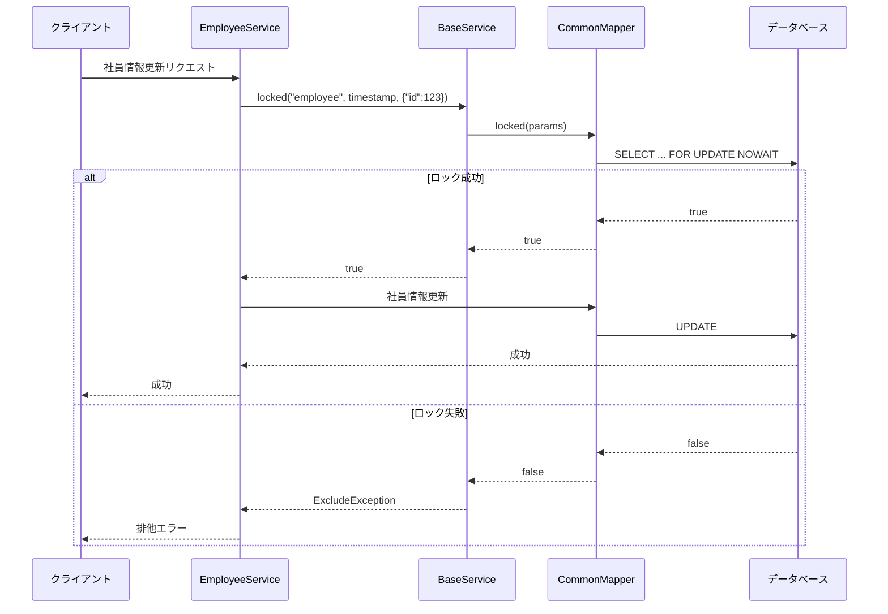

## 基底サービス

`src/main/java/com/example/orgchart_api/service/BaseService.java`

```java
import com.example.orgchart_api.exception.ExcludeException;
import com.example.orgchart_api.mapper.CommonMapper;
import org.slf4j.Logger;
import org.slf4j.LoggerFactory;
import org.springframework.stereotype.Service;

import java.sql.Timestamp;
import java.util.HashMap;
import java.util.Map;
import java.util.Set;

/**
 * 基底サービスクラス
 * 排他制御とシーケンス取得の共通処理
 *
 * @author KSC Tomomichi Iwasawa
 * @version 2.0 - Spring Boot 3.5 対応リファクタリング
 */
@Service
public class BaseService {

    private static final Logger logger = LoggerFactory.getLogger(BaseService.class);

    private final CommonMapper commonMapper;

    public BaseService(CommonMapper commonMapper) {
        this.commonMapper = commonMapper;
    }

    /**
     * 排他ロックを取得する
     * ※ロックが取得できない場合は ExcludeException をスロー
     *
     * @param tableName テーブル名
     * @param lstupdtTmstmp 最終更新日時
     * @param primaryKeys 主キー（カラム名と値のペア）
     * @return 成功時 true
     * @throws ExcludeException ロック取得失敗時
     */
    protected boolean locked(String tableName, Timestamp lstupdtTmstmp, Map<String, Object> primaryKeys) throws ExcludeException {
        Map<String, Object> paramMap = new HashMap<>();
        paramMap.put("tableName", tableName);
        paramMap.put("lstupdtTmstmp", lstupdtTmstmp);
        paramMap.put("primaryKeys", Set.copyOf(primaryKeys.entrySet())); // エントリセット渡し

        Boolean result = commonMapper.locked(paramMap);
        if (result == null || !result) {
            logger.warn("排他ロック取得失敗: {}", paramMap);
            throw new ExcludeException(paramMap);
        }
        return true;
    }

    /**
     * シーケンス名から値を取得
     *
     * @param sequenceName シーケンス名
     * @return シーケンス値
     */
    protected String sequence(String sequenceName) {
        return commonMapper.sequence(sequenceName);
    }
}

```

#### 已深度思考

> この`BaseService`クラスは共通の基底サービスとして、排他制御とシーケンス取得を提供します。
> プロジェクトのサービス層に配置する必要があります。
> 配置場所: `src/main/java/com/example/orgchart_api/service/BaseService.java`
> ただし、以下の点に注意:

1.  `ExcludeException`は`com.example.orgchart_api.exception`パッケージに配置されていると仮定
2.  `CommonMapper`は`com.example.orgchart_api.mapper`パッケージに配置されていると仮定
    > ただし、提供されたコードには`ExcludeException`や`CommonMapper`の実装は含まれていませんが、それらは別途存在すると仮定して進めます。
    > また、ログ出力には SLF4J を使用しています。
    > コードの内容は変更せずに、パッケージ宣言を追加して配置します。
    > 配置先ディレクトリ構造:
    > src/
        main/
           java/
               com/example/orgchart_api/
                   service/   <-- このディレクトリに配置
                       BaseService.java
    > ファイル内容:

### BaseService クラスの配置

`BaseService`クラスはサービス層の共通機能（排他制御とシーケンス取得）を提供するため、サービスパッケージに配置します。Spring のサービスコンポーネントとして管理されるべきです。

**配置先パッケージ**:  
`src/main/java/com/example/orgchart_api/service/BaseService.java`

```java
package com.example.orgchart_api.service;

import com.example.orgchart_api.exception.ExcludeException;
import com.example.orgchart_api.mapper.CommonMapper;
import org.slf4j.Logger;
import org.slf4j.LoggerFactory;
import org.springframework.stereotype.Service;

import java.sql.Timestamp;
import java.util.HashMap;
import java.util.Map;
import java.util.Set;

/**
 * 基底サービスクラス
 * 排他制御とシーケンス取得の共通処理
 */
@Service
public class BaseService {

    private static final Logger logger = LoggerFactory.getLogger(BaseService.class);

    private final CommonMapper commonMapper;

    public BaseService(CommonMapper commonMapper) {
        this.commonMapper = commonMapper;
    }

    /**
     * 排他ロックを取得する
     * ※ロックが取得できない場合は ExcludeException をスロー
     *
     * @param tableName テーブル名
     * @param lstupdtTmstmp 最終更新日時
     * @param primaryKeys 主キー（カラム名と値のペア）
     * @return 成功時 true
     * @throws ExcludeException ロック取得失敗時
     */
    protected boolean locked(String tableName, Timestamp lstupdtTmstmp, Map<String, Object> primaryKeys) throws ExcludeException {
        Map<String, Object> paramMap = new HashMap<>();
        paramMap.put("tableName", tableName);
        paramMap.put("lstupdtTmstmp", lstupdtTmstmp);
        paramMap.put("primaryKeys", Set.copyOf(primaryKeys.entrySet())); // エントリセット渡し

        Boolean result = commonMapper.locked(paramMap);
        if (result == null || !result) {
            logger.warn("排他ロック取得失敗: {}", paramMap);
            throw new ExcludeException(paramMap);
        }
        return true;
    }

    /**
     * シーケンス名から値を取得
     *
     * @param sequenceName シーケンス名
     * @return シーケンス値
     */
    protected String sequence(String sequenceName) {
        return commonMapper.sequence(sequenceName);
    }
}
```

### 関連コンポーネントの配置

1. **ExcludeException クラス**:  
   `src/main/java/com/example/orgchart_api/exception/ExcludeException.java`

   ```java
   package com.example.orgchart_api.exception;

   import java.util.Map;

   /**
    * 排他制御例外クラス
    */
   public class ExcludeException extends RuntimeException {
       private final Map<String, Object> context;

       public ExcludeException(Map<String, Object> context) {
           super("排他ロック取得失敗");
           this.context = context;
       }

       public Map<String, Object> getContext() {
           return context;
       }
   }
   ```

2. **CommonMapper インターフェース**:  
   `src/main/java/com/example/orgchart_api/mapper/CommonMapper.java`

   ```java
   package com.example.orgchart_api.mapper;

   import org.apache.ibatis.annotations.Mapper;
   import org.apache.ibatis.annotations.Param;
   import java.sql.Timestamp;
   import java.util.Map;
   import java.util.Set;

   @Mapper
   public interface CommonMapper {
       /**
        * 排他ロックを取得
        * @param paramMap パラメータマップ
        * @return ロック取得結果
        */
       Boolean locked(@Param("paramMap") Map<String, Object> paramMap);

       /**
        * シーケンス値取得
        * @param sequenceName シーケンス名
        * @return シーケンス値
        */
       String sequence(String sequenceName);
   }
   ```

3. **Mapper XML ファイル**:  
   `src/main/resources/mapper/CommonMapper.xml`

   ```xml
   <?xml version="1.0" encoding="UTF-8"?>
   <!DOCTYPE mapper PUBLIC "-//mybatis.org//DTD Mapper 3.0//EN"
   "http://mybatis.org/dtd/mybatis-3-mapper.dtd">

   <mapper namespace="com.example.orgchart_api.mapper.CommonMapper">

       <!-- 排他ロック取得 -->
       <select id="locked" resultType="boolean">
           SELECT COUNT(*) > 0
           FROM ${paramMap.tableName}
           WHERE
           <foreach item="pk" index="index" collection="paramMap.primaryKeys"
                    separator=" AND " open="(" close=")">
               ${pk.key} = #{pk.value}
           </foreach>
           AND lstupdt_tmstmp = #{paramMap.lstupdtTmstmp}
           FOR UPDATE NOWAIT
       </select>

       <!-- シーケンス値取得 -->
       <select id="sequence" resultType="java.lang.String">
           SELECT nextval(#{sequenceName})
       </select>
   </mapper>
   ```

### 使用方法

#### サービスクラスでの継承例

```java
package com.example.orgchart_api.service;

import com.example.orgchart_api.dto.EmployeeDto;
import com.example.orgchart_api.exception.ExcludeException;
import com.example.orgchart_api.mapper.EmployeeMapper;
import org.springframework.stereotype.Service;
import org.springframework.transaction.annotation.Transactional;

import java.sql.Timestamp;
import java.util.HashMap;
import java.util.Map;

@Service
public class EmployeeService extends BaseService {

    private final EmployeeMapper employeeMapper;

    public EmployeeService(
            CommonMapper commonMapper,
            EmployeeMapper employeeMapper) {
        super(commonMapper);
        this.employeeMapper = employeeMapper;
    }

    @Transactional
    public void updateEmployee(EmployeeDto dto) throws ExcludeException {
        // 排他ロック取得
        Map<String, Object> keys = Map.of("employee_id", dto.getId());
        locked("employee_table", dto.getLastUpdated(), keys);

        // 社員情報更新
        employeeMapper.update(dto);
    }

    @Transactional
    public String createEmployee(EmployeeDto dto) {
        // シーケンスからID生成
        String newId = sequence("employee_seq");
        dto.setId(newId);

        // 社員情報登録
        employeeMapper.insert(dto);
        return newId;
    }
}
```

### 排他制御の仕組み



### 機能拡張ポイント

1. **ロックタイムアウトの設定**:

   ```java
   @Mapper
   public interface CommonMapper {
       @Select("SELECT pg_advisory_xact_lock(hashtext(#{lockKey}))")
       void acquireAdvisoryLock(String lockKey);
   }

   // 使用例
   public void performWithLock(String lockKey) {
       commonMapper.acquireAdvisoryLock(lockKey);
       // 排他処理
   }
   ```

2. **シーケンスキャッシュの追加**:

   ```java
   protected Map<String, AtomicInteger> sequenceCache = new ConcurrentHashMap<>();

   protected String cachedSequence(String sequenceName, int cacheSize) {
       if (!sequenceCache.containsKey(sequenceName)) {
           synchronized(this) {
               if (!sequenceCache.containsKey(sequenceName)) {
                   // 初期値取得
                   String startVal = commonMapper.sequence(sequenceName);
                   sequenceCache.put(sequenceName, new AtomicInteger(Integer.parseInt(startVal)));
               }
           }
       }
       return String.valueOf(sequenceCache.get(sequenceName).getAndIncrement());
   }
   ```

3. **オプティミスティックロックの拡張**:
   ```sql
   <!-- CommonMapper.xml -->
   <update id="optimisticLockUpdate">
       UPDATE ${tableName}
       SET
         ${setClause},
         lstupdt_tmstmp = NOW()
       WHERE
         <foreach item="pk" collection="primaryKeys"
                  separator=" AND ">${pk.key}=#{pk.value}</foreach>
         AND lstupdt_tmstmp = #{originalTimestamp}
   </update>
   ```

この基底サービスを活用することで、各サービスクラスで共通の排他制御とシーケンス管理を効率的に実装できます。特に人事データの更新処理では、複数ユーザーによる同時更新を防ぐために排他制御が不可欠です。
